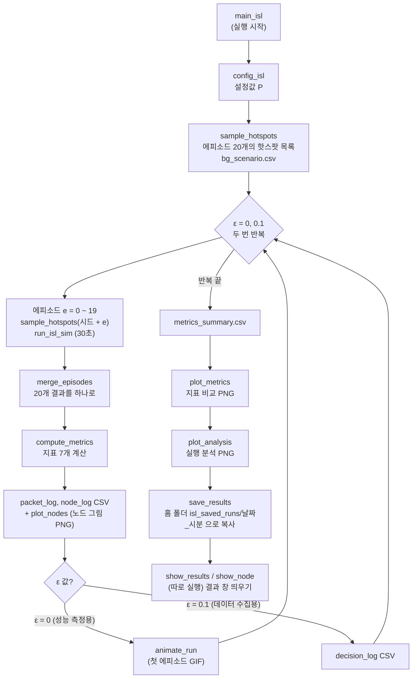
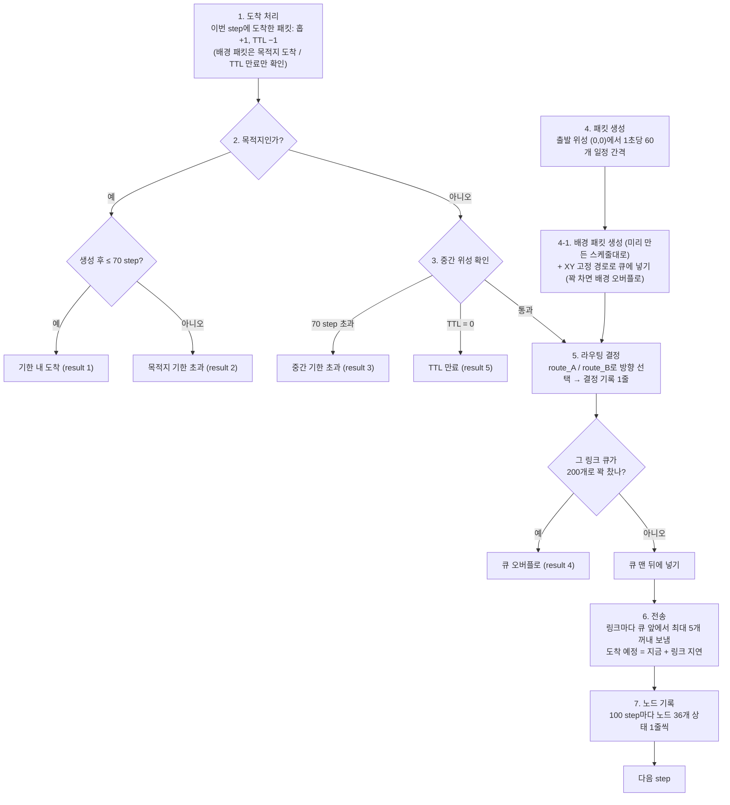
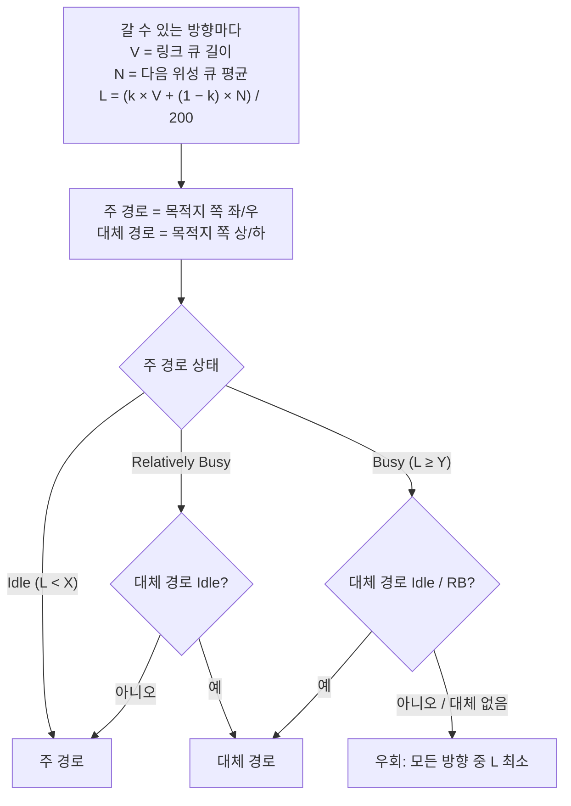

# 시뮬레이션 코드 흐름

ISL 6x6 Grid 라우팅 시뮬레이션이 **어떤 순서로, 어떤 파일을 거쳐** 돌아가는지 정리한 문서.
라우팅은 route_A (최단 경로) / route_B (부하 고려) 중 하나를 골라 씀.
10분을 30초짜리 에피소드 20개로 나눠 돌리고, 에피소드마다 배경 트래픽 핫스팟(혼잡 지도)이 바뀜.

---

## 1. 전체 흐름 한눈에 보기



| 순서 | 파일 | 하는 일 |
| --- | --- | --- |
| 1 | `main_isl` | 전체 실행. 아래 파일들을 차례로 부름 |
| 2 | `config_isl` | 모든 설정값을 `P`에 담아 돌려줌 |
| 3 | `bg_traffic` | `sample_hotspots`: 에피소드마다 핫스팟(과부하 송신 큐) 위치, 개수, 세기를 시드로 뽑음 |
| 4 | `run_isl_sim` | 에피소드 1개(30초) 실행 → 결과 `R` |
| 5 | `episodes` | `merge_episodes`: 에피소드 20개 결과를 하나로 합침 |
| 6 | `compute_metrics` | 합친 결과로 지표 7개 계산 → `M` |
| 7 | `plot_nodes` | `node_log`로 노드 요약 지도, 손실 많은 노드 시간 변화 PNG |
| 8 | `animate_run` | (ε = 0일 때) 첫 에피소드의 처음 0.2초 애니메이션 GIF |
| 9 | `plot_metrics` | 지표 비교 그래프 `metrics_summary.png` |
| 10 | `plot_analysis` | 실행 분석 그래프 `run_analysis.png` |
| 11 | `save_results` | 코드 + 결과를 홈 폴더의 `isl_saved_runs\날짜_시분`으로 복사 |
| 12 | `show_results`, `show_node` | (사용자가 따로 실행) 저장된 결과를 창에 띄움 |

---

## 2. 함수 호출 관계

```
main_isl
├─ config_isl                  → P (설정값)
├─ sample_hotspots(P, G, 시드)  → 에피소드마다 P.bgFlows, P.bgOnRate, P.bgSeed를 채움 (bg_traffic.py)
├─ run_isl_sim(P, ...)         → R (에피소드 1개 결과)
│   ├─ build_grid(P)           → G (6x6 Grid, 링크 구조)
│   ├─ make_bg_schedule(P)     → 배경 흐름별 step마다 생성 개수 (ON/OFF + Poisson)
│   ├─ route_A / route_B       → 다음 방향 (P.routeName으로 선택, 패킷이 위성에 올 때마다 호출)
│   └─ NodeLog                 → 노드 기준 기록 (node_log.py)
├─ merge_episodes(Rs, P)       → 에피소드 20개를 합친 R (episodes.py)
├─ compute_metrics(R, Pt)      → M (지표)
├─ save_node_plots(...)        → node_map, node_time PNG (plot_nodes.py)
├─ animate_run(R, P, ...)          ─┐
├─ plot_metrics(T, Pt, ...)         ├─ viz_colors (그래프 색)
├─ plot_analysis(runs, Pt, ...)    ─┘
└─ save_results(...)
```

주요 데이터 묶음

| 이름 | 만드는 곳 | 내용 |
| --- | --- | --- |
| `P` | `config_isl` | 설정값 (Grid, 큐 200, 링크 용량 5, 지연, 기한 70, 생성률, 라우팅 이름, k, X, Y, 에피소드, 배경 `P.bg...`) |
| `Pt` | `episodes.total_params` | 후처리용 `P` 복사본 (simTime = 에피소드 길이 x 개수 = 10분) |
| `G` | `build_grid` | Grid 구조 (링크 번호, 링크별 다음 위성과 지연, 위성별 갈 수 있는 방향) |
| `R` | `run_isl_sim` / `merge_episodes` | 실행 결과 (패킷별 생성, 종료 시각, 상태, 홉 수, 에피소드 번호, 결정 기록, 노드 기록, 배경 개수) |
| `M` | `compute_metrics` | 지표 7개 + 손실 원인별 개수 + 배경 개수 |
| `T` | `main_isl` | 실행별 `M`을 모은 표 → `metrics_summary.csv` |

---

## 3. `build_grid`: Grid 만들기

- 위성 좌표 `(p, s)`: p = 궤도면(좌/우), s = 궤도면 안 위성 번호(상/하)
- 위성마다 나가는 링크 최대 4개: **1 상(s−1), 2 하(s+1), 3 좌(p−1), 4 우(p+1)**
- Grid 끝은 반대편과 연결하지 않음 → 모서리 위성은 링크 2개, 가장자리는 3개
- 링크마다 저장: 다음 위성(`nextP`, `nextS`), 지연(`linkDelay`: 상/하 7, 좌/우 2 step)

---

## 4. `run_isl_sim`: 에피소드 1개 실행 (핵심)

1 step = 1 ms. 에피소드는 큐가 빈 상태에서 시작해 30,000 step 동안 아래 단계를 반복.



| 단계 | 내용 | 관련 변수 |
| --- | --- | --- |
| 1. 도착 처리 | 도착 예정 칸(`arrivalSlot`)에서 이번 step 도착 패킷을 꺼냄 | `hops`, `ttl` |
| 2. 목적지 확인 | 목적지면 기한 안/밖 판정 후 종료 | `status` = 1 or 2, `endTime` |
| 3. 중간 위성 확인 | 기한 초과 → TTL 만료 순으로 확인, 해당되면 종료 | `status` = 3 or 5 |
| 4. 패킷 생성 | 출발 위성에서 새 패킷 생성 (t = 1, 18, 35 ... ms) | `genTime`, `packet_id` |
| 4-1. 배경 패킷 | 스케줄(`bgSchedule[흐름, t]`)만큼 만들고 XY 경로 링크 큐에 넣음 | `bgStat`, `bg_enqueue` |
| 5. 라우팅 결정 | 1, 4번 주 흐름 패킷마다 라우팅 호출 → 큐에 넣기, 결정 기록 저장 | `queueLen`, `decisionLog` |
| 6. 전송 | 링크마다 최대 `linkCapacity`(5)개 전송 (주 흐름과 배경이 같은 큐, 먼저 온 순서) | `queueBuf`, `arrivalSlot`, `linkSent` |
| 7. 노드 기록 | `nodeLogInterval`(100) step마다 노드별 큐, 보낸 수, 손실 기록 | `nodeLog` |

- **배경을 주 흐름보다 먼저 큐에 넣음**: 주 흐름 라우팅이 이번 step의 부하까지 보고 판단하게
- **ε 무작위 선택**: 5단계에서 확률 ε로, 갈 수 있는 방향 중 하나를 무작위로 고름 (라우팅이 고른 방향이 다시 나올 수도 있음) (`choiceType` = 4)
- **종료 조건**: 생성 기간(30초)이 끝나고 진행 중인 주 흐름 패킷이 하나도 없으면 종료
- **링크별 큐**: 링크마다 원형 버퍼(`queueBuf`, `queueHead`, `queueLen`) → 먼저 들어온 패킷이 먼저 나감(FIFO)

---

## 5. 배경 트래픽 (`bg_traffic`): 송신 큐 핫스팟

주 흐름이 아닌, 일부러 혼잡을 만드는 패킷. 라우팅(A, B, 강화학습)이 제어하지 않는 고정 경로로 보내고, 지표 계산에서는 제외.

**핫스팟** = 위성 하나의 한 방향 송신 큐가 과부하된 것. 그 위성에서 그 방향 이웃으로 가는 1홉 배경 흐름으로 만듦.

| 항목 | 값 |
| --- | --- |
| 핫스팟 개수 | 에피소드마다 2~5개 (무작위) |
| 위치 | 격자 전체 (도착 위성 제외). 주 흐름과 관련 있는 큐(출발과 도착 사이 사각형 안, 목적지 쪽 방향)를 3배 더 잘 뽑음 |
| 세기 | 링크 용량의 0.7~2.0배 (3.5~10개/step). 1.0배를 넘으면 그 큐가 넘치기 시작 |
| 안전장치 | 관련 있는 큐 1개 이상 포함, 막힌 큐(1.8배 이상)를 빼도 도착할 길이 있는 시나리오만 사용 |
| ON / OFF | 평균 150 / 750 step (지수분포), ON일 때 매 step Poisson 분포로 생성 |
| 시드 | 에피소드 e는 시작 시드(`P.bgScenarioSeed`, 기본 1) + e. 같은 시작 시드면 20개 지도가 그대로 재현 |
| 경로 | XY 경로 (목적지 쪽 좌/우 먼저, 같은 열이면 상/하) |

에피소드마다 혼잡 지도가 달라서, 라우팅이 "특정 길만 피하면 된다"를 외우지 못하고 지금 막힌 곳을 보고 판단해야 함.

---

## 6. 라우팅: 다음 방향 고르기

패킷이 위성에 도착할 때마다 호출. 입력과 출력이 같아서 `config_isl.py`의 `P.routeName`만 바꾸면 교체됨 (나중에 강화학습 route_C도 같은 자리).

### `route_A`: 최단 경로 (기준선)

- 링크 지연을 가중치로 목적지까지 최소 지연 합을 미리 계산 (Dijkstra, `G.distToDst`)
- 매번 "다음 위성까지 지연 + 거기서 목적지까지 최소 지연"이 가장 작은 방향을 고름. **큐(부하)는 보지 않음**
- 최단 경로가 여러 개면 우 > 좌 > 하 > 상 (좌/우 먼저) → 항상 ㄱ자 경로
- `choiceType`은 항상 1, L과 N은 기록용

### `route_B`: 부하 고려 (Liu et al. 단순화)



- 현재 설정: k = 0.5, X = 0.5, Y = 0.8 (설계 추천값, 논문 값 아님)
- 출력: `nextDir`(1 상, 2 하, 3 좌, 4 우), `choiceType`(1 주, 2 대체, 3 우회), 4방향 `L`, `N`

---

## 7. `compute_metrics`: 지표 계산

에피소드 20개를 합친 `R`의 주 흐름 패킷별 결과로 지표 7개를 계산.

| 지표 | 계산 |
| --- | --- |
| Average Latency | 도착 패킷의 (종료 − 생성) 평균 |
| Packet Loss Rate | (생성 수 − 기한 내 도착 수) / 생성 수 |
| Throughput | 기한 내 도착 수 × 160 Byte × 8 / 총 시간(10분) |
| On-time Delivery Rate | 기한 내 도착 수 / 생성 수 |
| Consecutive Packet Loss Length | 패킷 id 순서로 연속 손실 최대 길이 (에피소드 경계에서 끊음) |
| Route Change Count | 도착 패킷끼리 직전 패킷과 경로가 다른 횟수 (에피소드 경계에서 끊음) |
| Average Hop Count | 도착 패킷 홉 수 평균 |

---

## 8. 결과 저장과 확인

| 단계 | 파일 | 결과물 |
| --- | --- | --- |
| 시작 | `main_isl` | `bg_scenario.csv` (에피소드별 핫스팟) |
| 실행마다 | `main_isl` | `packet_log_*.csv`, `node_log_*.csv`, `node_map_*.png`, `node_time_*.png`, `decision_log_*.csv` (ε = 0.1), `anim_*.gif` (ε = 0) |
| 반복 끝 | `main_isl` | `metrics_summary.csv` |
| 반복 끝 | `plot_metrics` | `metrics_summary.png` |
| 반복 끝 | `plot_analysis` | `run_analysis.png` |
| 마지막 | `save_results` | 홈 폴더 `isl_saved_runs\날짜_시분\code\`, `results\` 로 복사 (환경변수 `ISL_SAVE_ROOT`로 변경 가능) |
| 따로 실행 | `show_results` | 표 + 그래프 + 노드 그림 + 애니메이션 창 |
| 따로 실행 | `show_node p s` | 노드 1개 시간 변화 + 노드 요약 지도 |
| 따로 실행 | `check_bg` | 배경 트래픽 검증 (회귀, 보존 법칙, 링크 용량, 재현성) |

CSV 각 열의 의미는 [`csv.md`](csv.md) 참고.

---

## 9. 값 변경

모두 `config_isl`에서 수정.

| 바꿀 것 | 변수 |
| --- | --- |
| 생성률, 패킷 크기, 기한, 큐 용량, 링크 용량 | `P.genRate`, `P.packetSize`, `P.deadline`, `P.queueMax`, `P.linkCapacity` |
| 라우팅 방식 (A / B, 나중에 강화학습) | `P.routeName` |
| B의 가중치와 임계값 | `P.k`, `P.X`, `P.Y` |
| 에피소드 길이와 개수 | `P.simTime`, `P.numEpisodes` |
| 배경 트래픽 (개수, 세기, ON/OFF, 시작 시드) | `P.bgNumMin`, `P.bgNumMax`, `P.bgLoadMin`, `P.bgLoadMax`, `P.bgOnMean`, `P.bgOffMean`, `P.bgScenarioSeed` |
| 노드 기록 간격, 애니메이션 길이 | `P.nodeLogInterval`, `P.animDuration` |
| 결과 저장 경로 | 환경변수 `ISL_SAVE_ROOT` (기본: 홈 폴더 `isl_saved_runs`) |
| 그래프 색 | `viz_colors` |
