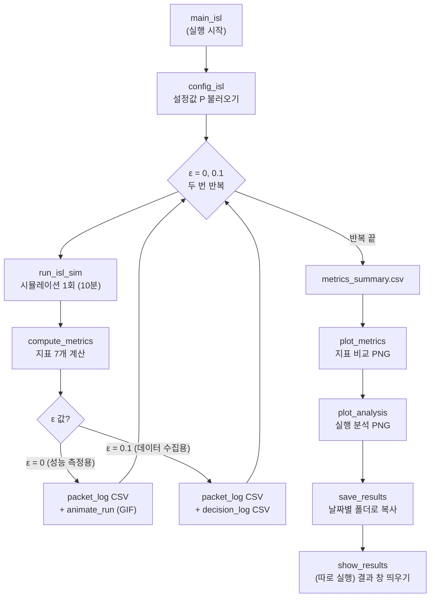
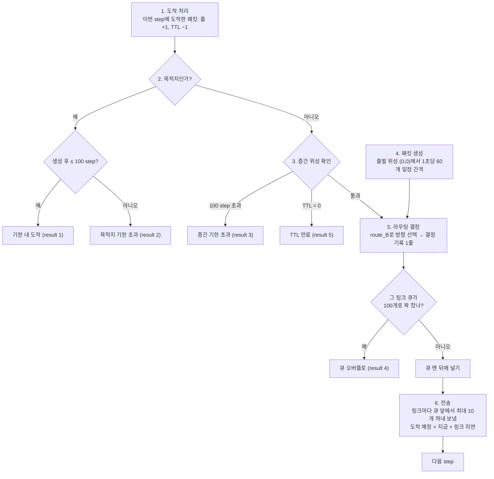
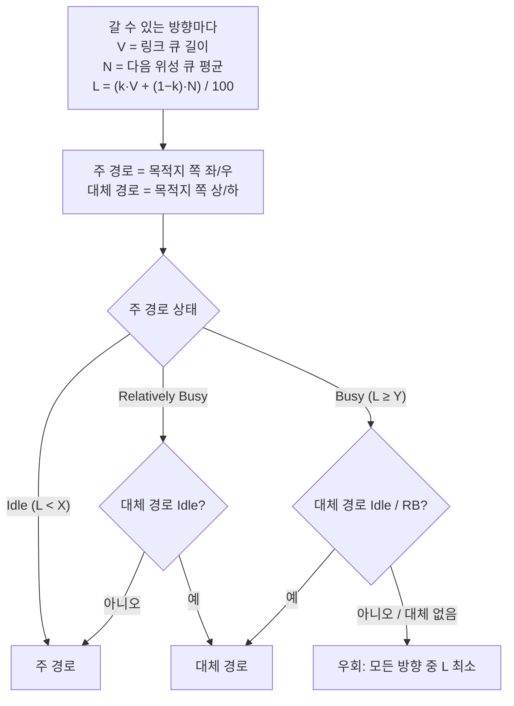

# 시뮬레이션 코드 흐름

ISL 6x6 Grid B 라우팅 시뮬레이션이 **어떤 순서로, 어떤 파일을 거쳐** 돌아가는지 정리한 문서입.

---

## 1. 전체 흐름 한눈에 보기



| 순서 | 파일 | 하는 일 |
| --- | --- | --- |
| 1 | `main_isl` | 전체 실행. 아래 파일들을 차례로 부름 |
| 2 | `config_isl` | 모든 설정값을 `P`에 담아 돌려줌 |
| 3 | `run_isl_sim` | 시뮬레이션 1회 실행 → 결과 `R` |
| 4 | `compute_metrics` | `R`로 지표 7개 계산 → `M` |
| 5 | `animate_run` | (ε = 0일 때) 0~200 ms 애니메이션 GIF 저장 |
| 6 | `plot_metrics` | 지표 비교 그래프 `metrics_summary.png` |
| 7 | `plot_analysis` | 실행 분석 그래프 `run_analysis.png` |
| 8 | `save_results` | 코드 + 결과를 날짜별 폴더로 복사 |
| 9 | `show_results` | (사용자가 따로 실행) 저장된 결과를 창에 띄움 |

---

## 2. 함수 호출 관계

```
main_isl
├─ config_isl            → P (설정값)
├─ run_isl_sim(P, ...)   → R (실행 결과)
│   ├─ build_grid(P)     → G (6x6 Grid, 링크 구조)
│   └─ route_B(...)      → 다음 방향 (패킷이 위성에 올 때마다 호출)
├─ compute_metrics(R, P) → M (지표)
├─ animate_run(R, P, ...)          ─┐
├─ plot_metrics(T, P, ...)          ├─ viz_colors (그래프 색)
├─ plot_analysis(runs, P, ...)     ─┘
└─ save_results(...)
```

주요 데이터 묶음

| 이름 | 만드는 곳 | 내용 |
| --- | --- | --- |
| `P` | `config_isl` | 설정값 (Grid 크기, 큐 용량, 지연, 생성률, k·X·Y, 총 시간 ...) |
| `G` | `build_grid` | Grid 구조 (링크 번호, 링크별 다음 위성·지연, 위성별 갈 수 있는 방향) |
| `R` | `run_isl_sim` | 실행 결과 (패킷별 생성·종료 시각, 상태, 홉 수, 결정 기록, 시간별 누적 수) |
| `M` | `compute_metrics` | 지표 7개 + 손실 원인별 개수 |
| `T` | `main_isl` | 실행별 `M`을 모은 표 → `metrics_summary.csv` |

---

## 3. `build_grid`: Grid 만들기

- 위성 좌표 `(p, s)`: p = 궤도면(좌/우), s = 궤도면 안 위성 번호(상/하)
- 위성마다 나가는 링크 최대 4개: **1 상(s−1), 2 하(s+1), 3 좌(p−1), 4 우(p+1)**
- Grid 끝은 반대편과 연결하지 않음 → 모서리 위성은 링크 2개, 가장자리는 3개
- 링크마다 저장: 다음 위성(`nextP`, `nextS`), 지연(`linkDelay`: 상/하 7, 좌/우 2 step)

---

## 4. `run_isl_sim`: 시뮬레이션 1회 (핵심)

1 step = 1 ms. 매 step마다 아래 6단계를 반복합니다.



| 단계 | 내용 | 관련 변수 |
| --- | --- | --- |
| 1. 도착 처리 | 도착 예정 칸(`arrivalSlot`)에서 이번 step 도착 패킷을 꺼냄 | `hops`, `ttl` |
| 2. 목적지 확인 | 목적지면 기한 안/밖 판정 후 종료 | `status` = 1 or 2, `endTime` |
| 3. 중간 위성 확인 | 기한 초과 → TTL 만료 순으로 확인, 해당되면 종료 | `status` = 3 or 5 |
| 4. 패킷 생성 | 출발 위성에서 새 패킷 생성 (t = 1, 18, 35 ... ms) | `genTime`, `packet_id` |
| 5. 라우팅 결정 | 1·4번 패킷마다 `route_B` 호출 → 큐에 넣기, 결정 기록 저장 | `queueLen`, `decisionLog` |
| 6. 전송 | 링크마다 최대 `linkCapacity`(10)개 전송 | `queueBuf`, `arrivalSlot` |

- **ε 무작위 선택**: 5단계에서 확률 ε로 `route_B` 대신 갈 수 있는 방향 중 하나를 무작위로 고름 (`choiceType` = 4)
- **종료 조건**: 생성 기간(`simTime` = 10분)이 끝나고 진행 중인 패킷이 하나도 없으면 종료
- **링크별 큐**: 링크마다 원형 버퍼(`queueBuf`, `queueHead`, `queueLen`) → 먼저 들어온 패킷이 먼저 나감(FIFO)

---

## 5. `route_B`: 다음 방향 고르기

패킷이 위성에 도착할 때마다 호출됩니다. **나중에 강화학습으로 바꿀 때 이 함수 교체**



- 현재 설정: k = 0.5, X = 0.5, Y = 0.8 (설계 추천값, 논문 값 아님)
- 출력: `nextDir`(1 상, 2 하, 3 좌, 4 우), `choiceType`(1 주, 2 대체, 3 우회), 4방향 `L`, `N`

---

## 6. `compute_metrics`: 지표 계산

`R`의 패킷별 결과로 지표 7개를 계산.

| 지표 | 계산 |
| --- | --- |
| Average Latency | 도착 패킷의 (종료 − 생성) 평균 |
| Packet Loss Rate | (생성 수 − 기한 내 도착 수) / 생성 수 |
| Throughput | 기한 내 도착 수 × 160 Byte × 8 / 총 시간 |
| On-time Delivery Rate | 기한 내 도착 수 / 생성 수 |
| Consecutive Packet Loss Length | 패킷 id 순서로 연속 손실 최대 길이 |
| Route Change Count | 도착 패킷끼리 직전 패킷과 경로가 다른 횟수 (결정 기록으로 경로 복원) |
| Average Hop Count | 도착 패킷 홉 수 평균 |

---

## 7. 결과 저장과 확인

| 단계 | 파일 | 결과물 |
| --- | --- | --- |
| 실행마다 | `main_isl` | `packet_log_*.csv`, `decision_log_*.csv` (ε = 0.1), `anim_*.gif` (ε = 0) |
| 반복 끝 | `main_isl` | `metrics_summary.csv` |
| 반복 끝 | `plot_metrics` | `metrics_summary.png` |
| 반복 끝 | `plot_analysis` | `run_analysis.png` |
| 마지막 | `save_results` | `saveRoot\날짜_시분\code\`, `results\` 로 복사 |
| 따로 실행 | `show_results` | 표 + 그래프 + 애니메이션 창 |

CSV 각 열의 의미는 [`csv.md`](csv.md) 참고.

---

## 8. 값을 바꾸고 싶을 때

| 바꾸고 싶은 것 | 수정할 곳 |
| --- | --- |
| 생성률, 패킷 크기, 총 시간, k·X·Y, 큐 용량 등 | `config_isl` |
| 라우팅 방식 (예: 강화학습으로 교체) | `route_B` |
| 결과 저장 경로 | `main_isl` 맨 아래 `saveRoot` |
| 그래프 색 | `viz_colors` |
